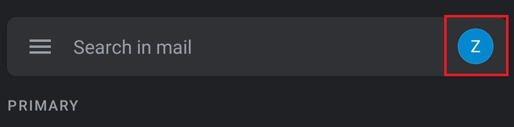
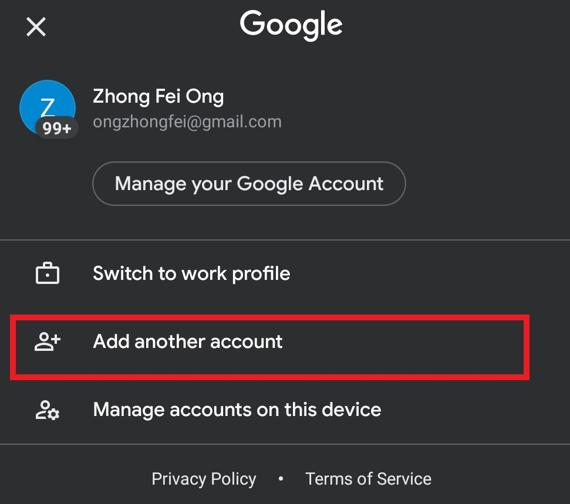
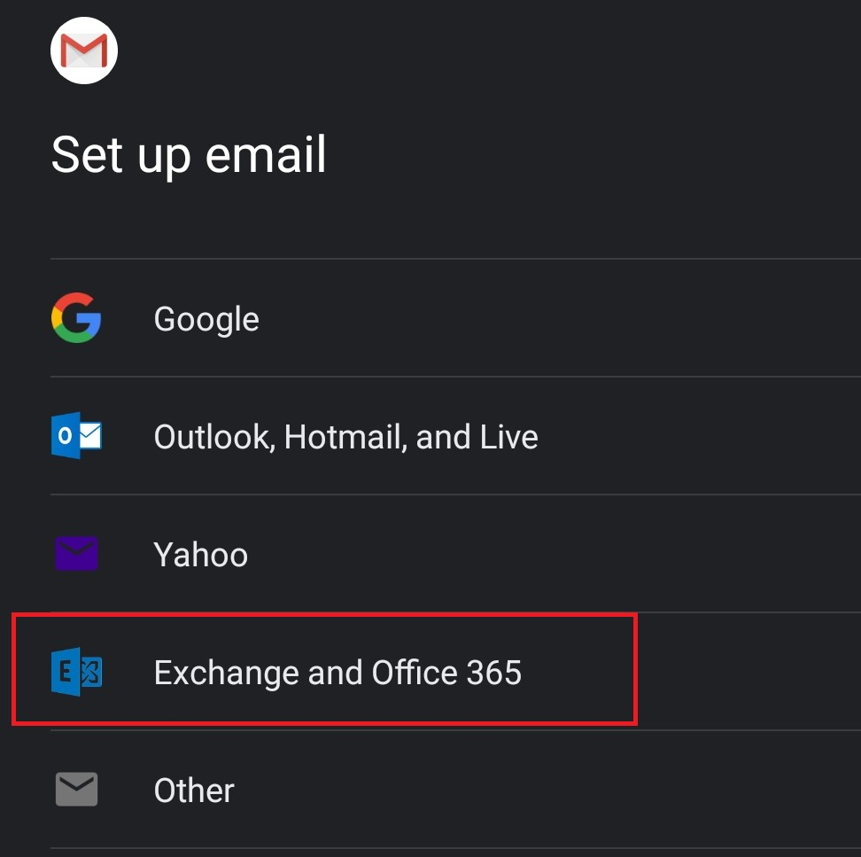
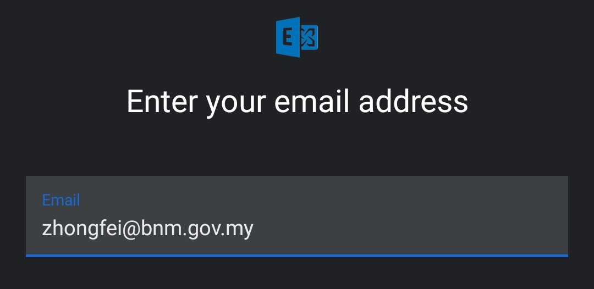
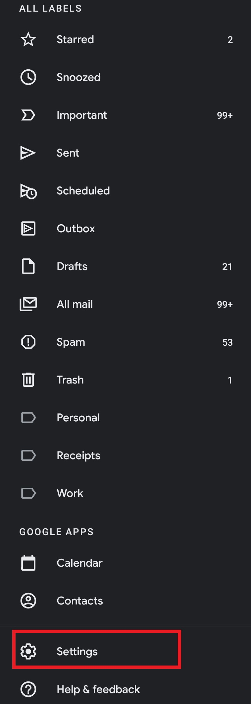
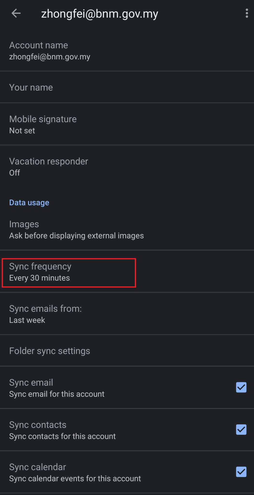
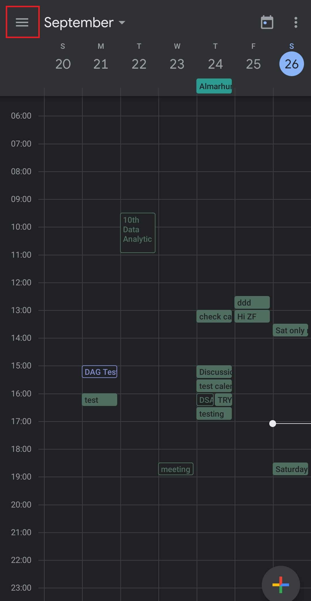
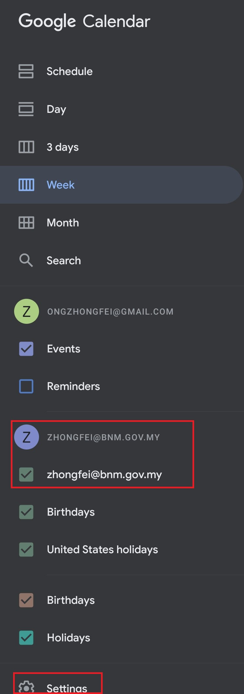
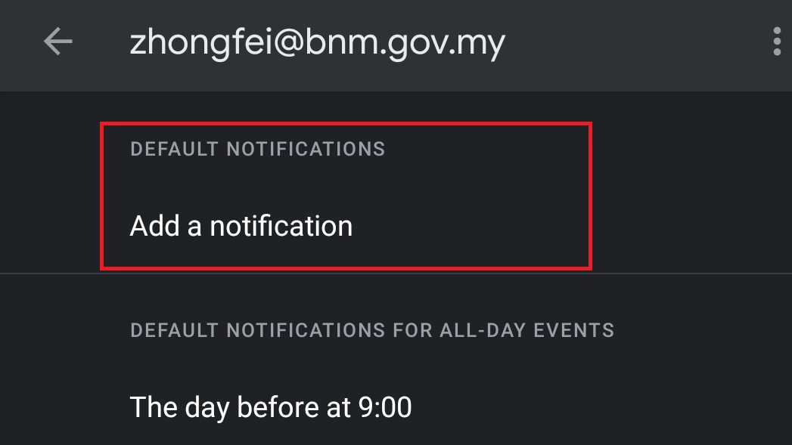

# Method 2: Add Outlook mail to Gmail

<!-- *Note: This method adds Outlook mail into the Gmail app* -->

## Add Outlook as another account in Gmail app
1.	Open your Gmail app and click on your profile

    
    

2. Click on **Add another account**

    
    

3. Click on **Exchange and Office 365**

    
  

4. Sign in into your Outlook account

    
    

## Adjust Outlook mail sync frequency (by default 30 minutes)
1.	Open your Gmail app and click on **Settings**

    <!--  -->
    
    

2. Click on **Sync frequency** to change the frequency

    <!--  -->
    
    

## Enable meeting notifications
1.	Open the **Calendar** and click on the Hamburger icon 

    <!--  -->
    
    

2. Make sure that your Outlook email address is ticked (so that you can see the Outlook calendar in the Calendar app). Click on **Settings** at the bottom

    <!--  -->
    
    

3. Click on your Outlook email and Click **DEFAULT NOTIFICATIONS**. Select the time period that you would like to receive a notification prior the meeting

    <!--  -->
    
  
