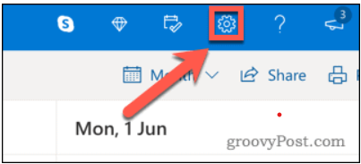
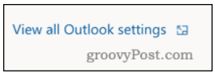
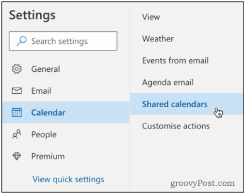
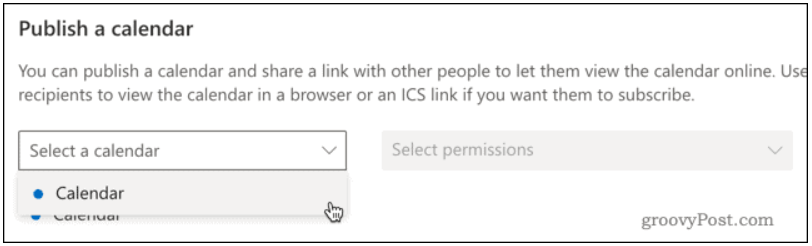
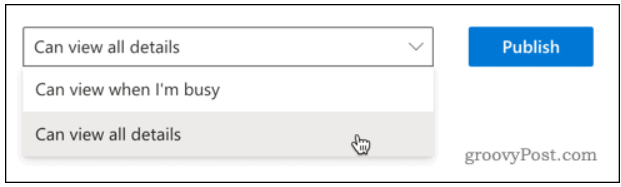
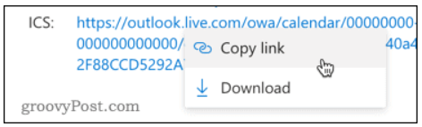
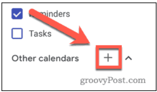
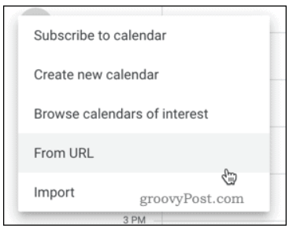

# Guide to sync Outlook calendar to Google calendar

Reference: [https://www.groovypost.com/howto/how-to-sync-outlook-calendar-with-google-calendar/](https://www.groovypost.com/howto/how-to-sync-outlook-calendar-with-google-calendar/)

## Make your Outlook calendar public
1.	[Sign in](https://outlook.office.com/) into your outlook account.

2. From the menu bar at the top, press the **Settings** cog icon.

    
    

3. Click the **View all Outlook settings option** at the very bottom of the menu.

    
  

4. In your Outlook settings menu, press the **Calendar** tab, then click on the **Shared calendars** option.

    
    

5. In the **Publish a calendar** section, click on **Select a calendar**, then select the **calendar** you want to sync.

    
    

6. Set permissions to **Can view all details**, then click the **Publish** button.

    
   

7. Click on the **ICS** link, then press **Copy link** to copy it to your clipboard.

    
  

## Publish Outlook calendar to Google calendar
8. At this point, you have make your Outlook calendar public and you can publish it to your Google Calendar. [Sign in](https://calendar.google.com/) into your Google account
   

9. In the left-hand menu, press the **plus (+) icon** next to the **Other calendars** option.

    
  

10. Select **From URL** from the menu list that appears.

    
  

11. Paste in your Outlook link in the **URL of calendar** box, then click **Add calendar** to add the calendar to your inbox.

    
  

## Setting notification

1. 

